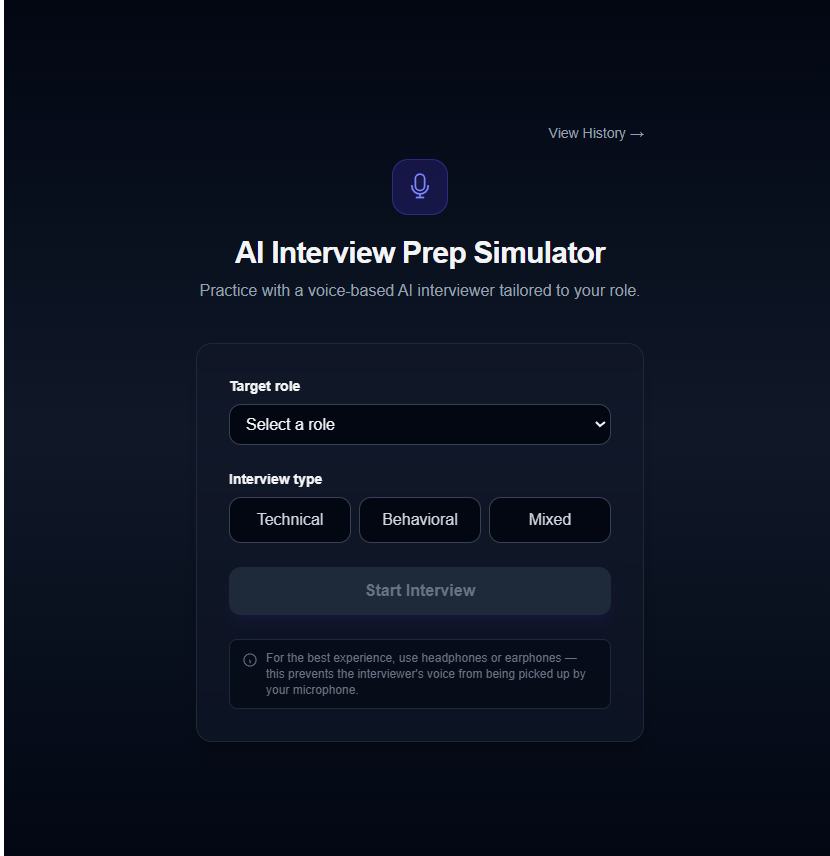

# AI Interview Prep Simulator

A voice-based mock interview platform. Pick a role, get asked real interview questions by an AI interviewer, answer out loud, and get scored feedback — including a full performance report at the end.

**Live demo:** https://voiceinterview-ai.vercel.app
**Backend API:** https://ai-mock-interviewer-efqs.onrender.com

> Note: the backend runs on a free-tier host, so the first request after a period of inactivity can take 30–60 seconds to wake up. Subsequent requests are fast.



## What it does

- Pick a target role (20+ options, from Data Analyst to Frontend Developer) and an interview type — Technical, Behavioral, or Mixed
- The AI interviewer asks questions one at a time, spoken aloud
- Answer by voice — your speech is transcribed live on screen
- Each answer is scored on a rubric (clarity, relevance, and technical accuracy or STAR structure) with written feedback
- Vague or incomplete answers can trigger one adaptive follow-up question
- Skip a question or end the interview early at any point
- Get a final performance report: overall score, strengths, weaknesses, and improved-answer examples for your weakest responses, plus the full transcript
- Past interviews are saved and viewable from a history page

## Tech stack

**Frontend:** Next.js, Tailwind CSS, Web Speech API (SpeechRecognition + SpeechSynthesis)
**Backend:** FastAPI, SQLAlchemy
**Database:** PostgreSQL (Supabase in production)
**AI:** Groq (Llama 3.3 70B) — question generation, answer scoring, and report generation, all via structured JSON prompts

**Deployment:** Vercel (frontend), Render (backend), Supabase (database)

## Why these choices

- **Web Speech API instead of paid speech services** — free, browser-native, zero per-use cost. Trade-off: works best in Chrome, and voice quality/accuracy is a step below paid alternatives like Whisper or ElevenLabs. Accepted as the right trade-off for a portfolio-scale project.
- **Anonymous identity, no login** — a UUID is generated and stored in the browser on first visit, so your interview history follows you on that browser/device without any signup friction. It won't follow you across different browsers or devices — that would need real accounts, a deliberate v2 scope decision.
- **For best results, use headphones** — without them, the mic can occasionally pick up the interviewer's own voice through your speakers.

## Running it locally

**Backend**
```bash
cd backend
python -m venv venv
venv\Scripts\activate        # Windows
pip install -r requirements.txt
# create a .env file (see .env.example) with DATABASE_URL and GROQ_API_KEY
python init_db.py
uvicorn app.main:app --reload
```

**Frontend**
```bash
cd frontend
npm install
npm run dev
```

The frontend expects the backend at `http://127.0.0.1:8000` by default (overridable via `NEXT_PUBLIC_API_BASE`).

## Project structure

```
backend/
  app/
    models/      SQLAlchemy models (sessions, questions, answers, reports)
    routers/     API endpoints
    services/    Groq client
frontend/
  src/app/
    page.js          Role + interview type selection
    interview/       Live interview screen (voice I/O, scoring, history panel)
    report/          Performance report
    history/         Past interviews
```

## Author

Built by Akash Kumar Pandit — [GitHub](https://github.com/imakash45) · [LinkedIn](https://linkedin.com/in/imakash45)